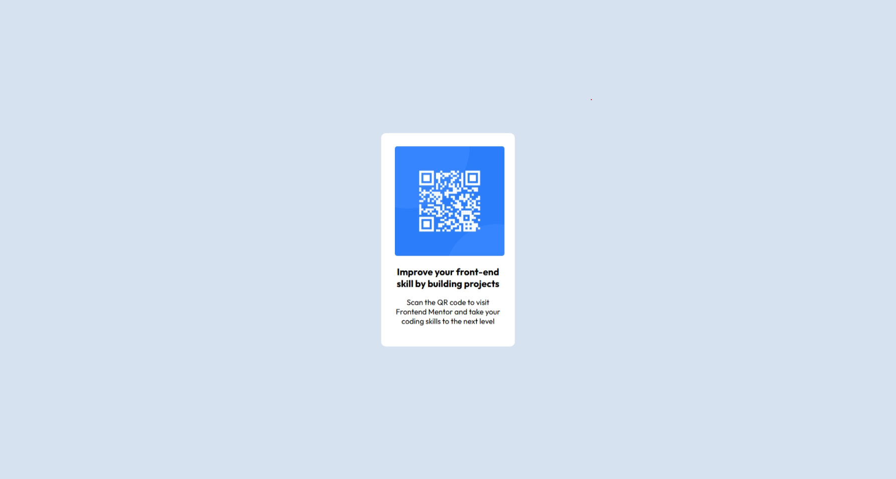

# Frontend Mentor - QR code component solution

This is a solution to the [QR code component challenge on Frontend Mentor](https://www.frontendmentor.io/challenges/qr-code-component-iux_sIO_H).
## Table of contents

- [Overview](#overview)
  - [Screenshot](#screenshot)
  - [Links](#links)
- [My process](#my-process)
  - [Built with](#built-with)
  - [What I learned](#what-i-learned)
- [Author](#author)

## Overview

### Screenshot



### Links

- Solution URL: [Solution URL here](https://github.com/abdullah09c/qr-code-component-main.git)
- Live Site URL: [Live site URL here](https://abdullah09c.github.io/qr-code-component-main/)

## My process

### Built with

- Semantic HTML5 markup
- CSS custom properties

### What I learned

Adding goolge font by url.

```html
<link rel="preconnect" href="https://fonts.googleapis.com" />
<link rel="preconnect" href="https://fonts.gstatic.com"  crossorigin />
<link
  href="https://fonts.googleapis.com/css2?family=Outfit:wght@400;700&display=swap"
  rel="stylesheet"
/>
```

```css
 font-family: 'Outfit', sans-serif;
```


## Author

- Name - [Abdullah Al Fuwad](#)
- Frontend Mentor - [@abdullah09c](https://www.frontendmentor.io/profile/abdullah09c)


